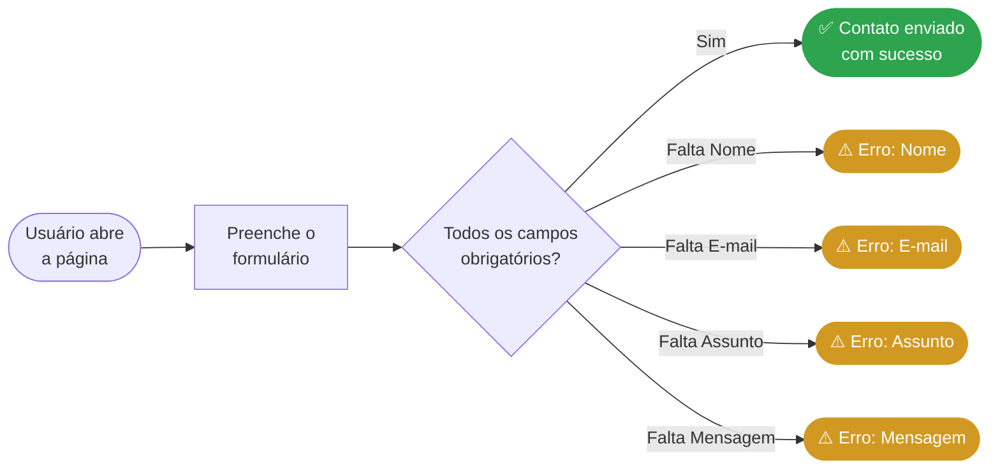
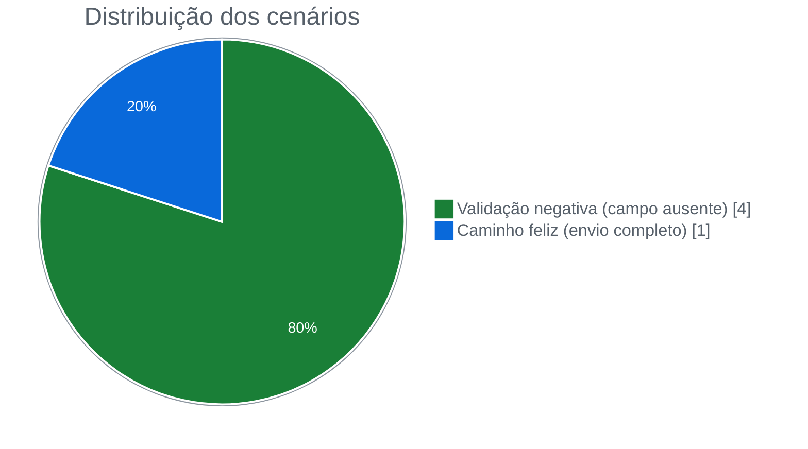
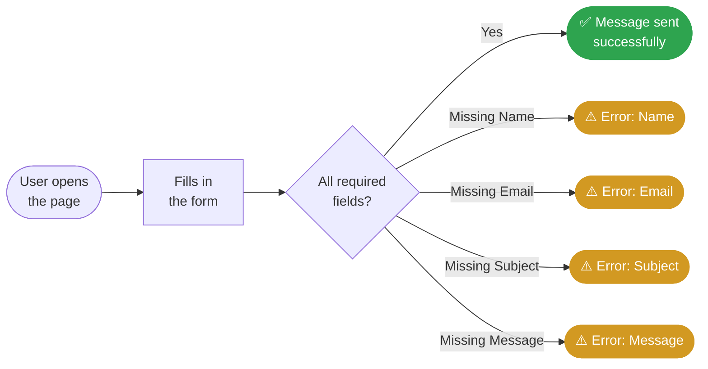
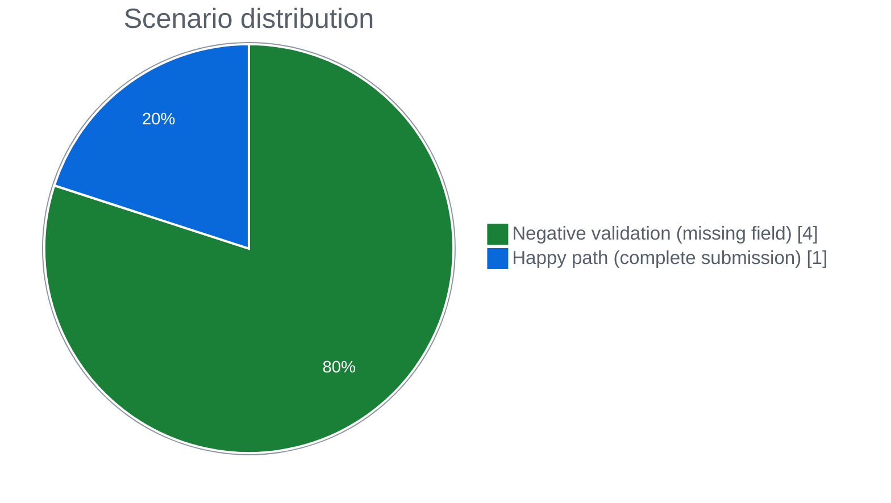

<div align="center">

# 📚 Hub de Leitura · Testes E2E de UI com Cypress

**Automatizei os testes do formulário de contato de uma plataforma de livros, com foco na validação dos campos obrigatórios**


🇧🇷 [Português](#-português) · 🇺🇸 [English](#-english)

</div>

---

## 🇧🇷 Português

### 🎯 Objetivo

O formulário de contato é por onde o usuário chega ao suporte. Se ele falha, a mensagem se perde. Se aceita dados incompletos, o atendimento recebe um contato que não consegue responder.

Com isso em mente, automatizei os testes do formulário do **Hub de Leitura** para validar duas coisas:

1. Se o usuário que preenche tudo corretamente consegue enviar a mensagem.
2. Se cada campo obrigatório bloqueia o envio e mostra uma mensagem clara do que está faltando.

### 🧭 Estratégia

Montei a suíte com **1 cenário positivo** e **4 cenários negativos**, isolando **um campo obrigatório por teste**. Fiz assim para que, quando um teste falhar, o erro já aponte direto para o campo com problema.



Dei mais peso aos cenários negativos porque, em formulário, o bug raramente está no caminho feliz. Ele aparece quando o usuário esquece de preencher algo. Por isso, **80% da suíte ficou dedicada ao tratamento de erro**.



### 🧪 Casos de teste

| # | Cenário | Tipo | Dado ausente | Resultado esperado |
|:-:|---|:-:|:-:|---|
| 1 | Envio com todos os campos preenchidos | ✅ Positivo | — | `Contato enviado com sucesso!` |
| 2 | Envio sem Nome | ⚠️ Negativo | Nome | `Por favor, preencha o campo Nome.` |
| 3 | Envio sem E-mail | ⚠️ Negativo | E-mail | `Por favor, preencha o campo E-mail.` |
| 4 | Envio sem Assunto | ⚠️ Negativo | Assunto | `Por favor, selecione o Assunto` |
| 5 | Envio sem Mensagem | ⚠️ Negativo | Mensagem | `Por favor, escreva sua Mensagem.` |

### 🗺️ Mapa de cobertura

| Campo | Tipo de elemento | Caminho feliz | Validação de erro |
|---|---|:-:|:-:|
| Nome | `input` | ✅ | ✅ |
| E-mail | `input` | ✅ | ✅ |
| Assunto | `select` | ✅ | ✅ |
| Mensagem | `textarea` | ✅ | ✅ |

> **Cobri os 4 campos obrigatórios** tanto no envio válido quanto no envio com falha.

### 📈 Resultados

- **Deixei as regras de negócio registradas no código.** As 5 mensagens do sistema estão nos testes. Se alguém mudar um texto ou remover uma validação, a suíte acusa.
- **Diagnóstico imediato.** Como separei um campo por teste, a falha já diz o que quebrou.
- **Seletores estáveis.** Usei os atributos `name` e `id`, que mudam bem menos que classes CSS. Com isso, os testes não quebram por mudança de layout.
- **Testes independentes.** Cada cenário começa com a página recarregada (`beforeEach` com `cy.visit`), sem depender do anterior.

### 🚀 Onde esse trabalho se aplica

- **Regressão:** rodando a cada alteração no front-end, a suíte garante que uma mudança visual não desligue uma validação.
- **Menos reteste manual:** a mesma bateria que tomaria minutos de cliques roda sozinha, sempre do mesmo jeito.
- **Integração contínua:** a suíte está pronta para entrar num pipeline e rodar em todo *pull request*.
- **Outros formulários:** a estratégia de 1 positivo + 1 negativo por campo obrigatório serve para cadastro, login e checkout.

### ▶️ Como executar

**Pré-requisitos:** Node.js e a aplicação Hub de Leitura rodando em `http://localhost:3000`.

```bash
npm install
npx cypress open   # modo interativo
npx cypress run    # modo headless
```

### 📁 Estrutura

```
hub-de-leitura-cypress-ui/
├── cypress/
│   ├── e2e/
│   │   └── contato.cy.js      # 5 cenários do formulário de contato
│   ├── fixtures/
│   └── support/
├── cypress.config.js          # baseUrl: http://localhost:3000/
└── package.json
```

---

## 🇺🇸 English

### 🎯 Goal

The contact form is how users reach support. If it fails, the message is lost. If it accepts incomplete data, support gets a request it can't answer.

So I automated tests for the **Hub de Leitura** contact form to check two things:

1. Whether a user who fills in everything correctly can send the message.
2. Whether each required field blocks submission and shows a clear message about what is missing.

### 🧭 Strategy

I built the suite with **1 positive scenario** and **4 negative scenarios**, isolating **one required field per test**, so a failure points straight to the broken field.



I focused on negative scenarios because form bugs rarely show up on the happy path. They appear when the user forgets something. That's why **80% of the suite covers error handling**.



### 🧪 Test cases

| # | Scenario | Type | Missing data | Expected result |
|:-:|---|:-:|:-:|---|
| 1 | Submit with all fields filled | ✅ Positive | — | `Contato enviado com sucesso!` |
| 2 | Submit without Name | ⚠️ Negative | Name | `Por favor, preencha o campo Nome.` |
| 3 | Submit without Email | ⚠️ Negative | Email | `Por favor, preencha o campo E-mail.` |
| 4 | Submit without Subject | ⚠️ Negative | Subject | `Por favor, selecione o Assunto` |
| 5 | Submit without Message | ⚠️ Negative | Message | `Por favor, escreva sua Mensagem.` |

*The app is in Portuguese, so I kept the expected messages in the original language.*

> **I covered all 4 required fields** on both valid and failing submissions.

### 📈 Results

- **I recorded the business rules as code.** All 5 system messages are in the tests. If someone changes a text or removes a validation, the suite flags it.
- **Instant diagnosis.** With one field per test, a failure tells exactly what broke.
- **Stable selectors.** I used `name` and `id` attributes, which change far less than CSS classes.
- **Independent tests.** Each scenario starts on a fresh page (`beforeEach` with `cy.visit`).

### 🚀 Where this applies

- **Regression:** running on every front-end change, the suite ensures a visual update never disables a validation.
- **Less manual retesting:** checks that take minutes of clicking run on their own, the same way every time.
- **Continuous integration:** the suite is ready to run on every pull request.
- **Other forms:** the 1 positive + 1 negative per required field strategy works for sign-up, login and checkout.

### ▶️ How to run

```bash
npm install
npx cypress open   # interactive
npx cypress run    # headless
```

---

<div align="center">

Feito por **Gustavo Anderson** · QA Engineer
[](https://www.linkedin.com/in/gustavo-anderson)
[](https://github.com/gustavoanderson)

</div>
